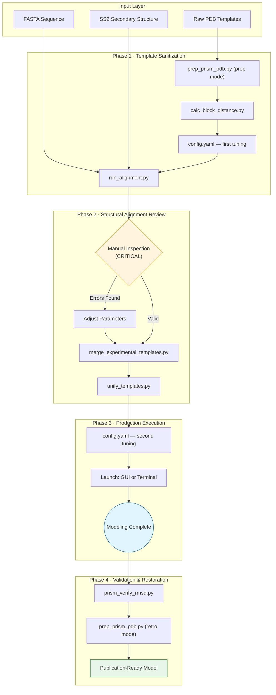

# PRISM: Protected-Region Insertion Suite for Modeling

<p align="center">
  
</p>

<p align="center">
  <strong>A high-fidelity integrative modeling pipeline for guaranteed experimental coordinate preservation in protein homology modeling and loop refinement.</strong>
</p>

<p align="center">
  <a href="https://www.python.org/"></a>
  <a href="https://salilab.org/modeller/"></a>
  <a href="https://nextflow.io/"></a>
  <a href="https://pixi.sh/"></a>
  <a href="https://opensource.org/licenses/MIT"></a>
  <a href="#"></a>
  <a href="https://docs.astral.sh/ruff/"></a>
</p>

---

**Author:** Richard López-Corbalan · Universidad de Alcalá (UAH) · richard.lopezc@uah.es  

---

## Table of Contents

1. [Scientific Background](#1-scientific-background)  
2. [Installation](#2-installation)  
3. [Repository Structure](#3-repository-structure)  
4. [Standard Operating Procedure (SOP)](#4-standard-operating-procedure-sop)  
5. [The Streamlit Dashboard](#5-the-streamlit-dashboard)  
6. [Pipeline Stages](#6-pipeline-stages)  
7. [Configuration Reference](#7-configuration-reference)  
8. [Execution Paradigms](#8-execution-paradigms)  
9. [Model Nomenclature](#9-model-nomenclature)  
10. [Utility Tools (`tools/`)](#10-utility-tools-tools)  
11. [HPC Configuration](#11-hpc-configuration)  
12. [Persistent Sessions & Multi-Instance Execution](#12-persistent-sessions--multi-instance-execution)  
13. [Portability](#13-portability)  
14. [Technical Implementation](#14-technical-implementation)  
15. [Benchmarking Recommendations](#15-benchmarking-recommendations)  
16. [Citation](#16-citation)  
17. [Acknowledgments](#17-acknowledgments)  
18. [License](#18-license)  

---

## 1. Scientific Background

Integrative structural biology frequently requires combining high-fidelity experimental coordinates (e.g., from X-ray crystallography or cryo-EM) with complete structure predictions (e.g., AlphaFold) to generate biologically viable, fully assembled models. This task is non-trivial for three compounding reasons:

### 1.1. The Template Averaging Problem

MODELLER's standard initialization generates starting coordinates by **weighting across all provided templates**. When an experimental partial structure (e.g., residues 306–472 of a crystal structure) is co-modeled with a full-length AlphaFold prediction, the shared coordinate region is deviated from its crystallographic ground truth (RMSD > 0.01 Å) **before any optimization even begins**, rendering downstream "fixation" steps irrelevant.

PRISM solves this through the ***prism-power* paradigm**: an asymmetric two-phase template weighting strategy that inflates the statistical weight of the experimental template by up to 1000:1 during initial restraint generation, anchoring the coordinate topology to the experimental ground truth before model production begins.

### 1.2. Loop–Ligand Clashes

Standard loop modeling algorithms sample conformational space freely, without knowledge of bound non-protein entities (DNA, RNA, ATP, glycosylations, small-molecule inhibitors). This produces steric penetrations — the modeled backbone physically intersects with the ligand — rendering the model biologically nonviable.

PRISM implements **Dynamic HETATM Repulsion Shields**: lower-bound harmonic distance restraints injected into the MODELLER objective function between protein Cα atoms and the center of mass of each bound molecule. These shields act as physical barriers, reshaping loop trajectories around occupied volumes without sacrificing predicted secondary structure.

### 1.3. Experimental Core Drift

Even when template averaging is avoided, standard MODELLER optimization routines apply gradient descent globally, inadvertently modifying experimentally determined backbone coordinates. PRISM overrides `select_atoms()` to completely exclude experimental residues from all optimization passes, guaranteeing **coordinate preservation** (mean 0.021 Å fixed-domain Cα RMSD in the raw modeling output; after optional thermodynamic post-processing, 99.97% of residues remain ≤ 0.1 Å across a 20-system benchmark).

---

## 2. Installation

### 2.1. Prerequisites

PRISM requires only **[Pixi](https://pixi.sh/)** as a prerequisite. Pixi handles all dependencies (Python 3.10–3.11, MODELLER, Nextflow, OpenMM, AmberTools, Streamlit, etc.) without requiring root access or manual Conda/pip configuration.

```bash
curl -fsSL https://pixi.sh/install.sh | bash
```

> **MODELLER License**: MODELLER requires a free academic license. Obtain your key at [salilab.org/modeller/registration.html](https://salilab.org/modeller/registration.html) and either place it in `license/modeller_license.key` or export it as `KEY_MODELLER` in your environment before running `setup`.

### 2.2. Setup

```bash
# 1. Clone the repository
git clone <repository-url> PRISM
cd PRISM

# 2. Initialize the environment and apply the MODELLER license
pixi run setup
```

`pixi run setup` creates the required directory structure (`input/`, `modeling_results/`, `output_tools/`) and automatically applies your MODELLER license key.

### 2.3. Supported Platforms

| Platform | Status |
|---|---|
| Linux (x86-64) | Fully supported |
| macOS (Intel x86-64) | Fully supported |
| macOS (Apple Silicon / ARM64) | Fully supported |
| Windows (WSL2) | Supported via WSL2 |

---

## 3. Repository Structure

```
PRISM/                                    # Repository root
├── PRISM/                                # Core Python package
│   ├── __init__.py
│   ├── __main__.py
│   ├── config.py                         # Pydantic configuration model (loads config.yaml)
│   ├── controller.py                     # Pipeline stage dispatcher
│   ├── dashboard.py                      # Streamlit GUI
│   ├── modeling_engine.py                # Custom MODELLER classes:
│   │                                     #   FixedRegionAutoModel, FixedRegionLoopModel
│   ├── psipred_client.py                 # PSIPRED REST API client
│   ├── utils.py                          # Alignment, secondary structure & ranking utilities
│   ├── ui_utils.py                       # Streamlit helper functions
│   ├── ui_icons.py                       # Dashboard icon definitions
│   ├── styles/                           # Custom CSS for dashboard themes
│   └── logo.png                          # PRISM branding
│
├── tools/                                # Utility scripts
│   ├── master.py                         # Full-SOP automation (one-command preparation)
│   ├── pdb_utils.py                      # Shared PDB parsing utilities
│   ├── prep_prism_pdb.py                 # PDB pre/post-processor (prep & retro modes)
│   ├── prism_verify_rmsd.py              # Experimental coordinate fidelity verifier
│   ├── calc_block_distance.py            # Cα-to-HETATM distance calculator
│   ├── unify_templates.py                # Template overlap resolver
│   ├── merge_experimental_templates.py   # Multi-structure experimental merger
│   ├── minimizer.py                      # OpenMM restrained energy minimizer
│   ├── parameterizer.py                  # Amber/GAFF2 parameterization
│   ├── run_alignment.py                  # Standalone alignment & PIR bullet-proofing
│   └── force_fields/                     # External FF parameters (Amber Parameter Database)
│
├── pipeline/
│   ├── orchestrator.nf                   # Nextflow DSL2 workflow (SLURM orchestration)
│   └── nextflow.config                   # Resource allocation (CPUs, memory)
│
├── input/                                # Input files (PDBs, FASTA, .ss2, .ali)
├── output_tools/                         # Intermediate outputs from utility tools
├── modeling_results/                     # Final model outputs and ranking CSVs
├── test/                                 # End-to-end examples (20 publication-benchmark systems)
├── config.yaml                           # Main pipeline configuration
├── pyproject.toml                        # Pixi workspace & dependency definitions
├── LICENSE                               # MIT license
├── .gitignore
└── README.md
```

---

## 4. Standard Operating Procedure (SOP)

This section describes the validated protocol for producing high-fidelity integrative models with PRISM. The pipeline consists of four phases.

> [!TIP]
> **Automation**: Phases 1–3 can be executed with a single command using `tools/master.py`. See [Section 10.6](#106-masterpy--full-sop-automator) for details.

### 4.1. Workflow Overview



### 4.2. Phase 1 · Environment & Template Preparation

1. **Environment initialization**: Run `pixi run setup` to verify the environment, MODELLER license, and directory structure.
2. **Input staging**: Place all `.pdb`, `.fasta`, and (optional) `.ss2` files into `input/`.
3. **PDB sanitization**: Run `tools/prep_prism_pdb.py` in `prep` mode on all input PDBs. This tool renumbers residues sequentially, splits protein/ligand chains to PRISM's chain conventions, and handles post-translational modifications (PTMs) as rigid-body attachments.
4. **Repulsion radius determination**: If bound molecules are present (DNA, RNA, ligands), run `tools/calc_block_distance.py` to compute the minimum Cα-to-ligand distance. Update `BLOCK_REPULSION_RADIUS` in `config.yaml` accordingly.
5. **First `config.yaml` tuning**: Set `PDB_TEMPLATE_FILES_NAMES` and all file basenames.
6. **Alignment generation**: Execute `tools/run_alignment.py` to produce the initial PIR alignment file.

### 4.3. Phase 2 · Structural Alignment Review

> [!IMPORTANT]
> The alignment file (`.ali`) must be **manually inspected** before proceeding. Incorrect alignment is the single most common source of modeling failure. Append `_reviewed` to the filename once validated.

7. **Multi-template merging**: If > 1 experimental template is used, run `tools/merge_experimental_templates.py` to create a unified experimental coordinate set.
8. **Template unification**: Execute `tools/unify_templates.py` to resolve sequence overlaps between templates. This tool trims lower-priority templates at the overlap boundary (with a configurable buffer), preventing MODELLER from averaging competing experimental coordinates.

### 4.4. Phase 3 · Configuration & Production Run

9. **Second `config.yaml` tuning**: Configure the *prism-power* weighting (`PRISM_POWER_SETTINGS`), parallelization parameters, and loop refinement settings.
10. **Pipeline launch**:

| Mode | Command | Best For |
|------|---------|----------|
| GUI (persistent) | `pixi run gui-prism-persist` | Interactive use, 3D visualization |
| Terminal (persistent) | `pixi run terminal-prism-persist` | HPC batch execution |
| Terminal (resume) | `pixi run terminal-prism-persist-resume` | Resuming interrupted runs |

### 4.5. Phase 4 · Validation & Structure Restoration

11. **Coordinate fidelity audit**: Run `tools/prism_verify_rmsd.py` to confirm that experimental coordinates are preserved (target: 0.000 Å RMSD for all protected residues).
12. **Structure restoration**: Apply `tools/prep_prism_pdb.py` in `retro` mode to the best-ranked models. This reinstates original PDB headers, original HETATM atom names, and rigid-body PTM coordinates using the metadata JSON generated in Phase 1.
13. **Energy minimization** *(optional, recommended for MD input)*: Run `tools/parameterizer.py` followed by `tools/minimizer.py` to resolve interfacial micro-clashes via restrained OpenMM minimization.

### 4.6. Naming Conventions

Adherence to these conventions ensures pipeline stability:

| Parameter | Recommended Pattern |
|-----------|---------------------|
| `PDB_TEMPLATE_FILES_NAMES` | `{PDBID}_prism_prep_unified.pdb` |
| `MANUAL_ALIGNMENT_BASENAME` | `{PDBID}_prism_prep.pdb_{CODE}_reviewed_merged_unified.ali` |
| `BLOCK_REPULSION_RADIUS` | Value from `calc_block_distance.py` (default: 100.0) |
| `PRISM_POWER_SETTINGS` | `PRECALCULATION` weight e.g. 1000:1; `PRECOMPUTED` e.g. 1:1 |

---

## 5. The Streamlit Dashboard

Launch via `pixi run gui-prism-persist`. The dashboard runs in the browser and is fully functional both locally and on remote HPC nodes (via SSH port forwarding).

**Remote HPC access:**
```bash
ssh -L 8501:localhost:8501 your_hpc_address
# Then open: http://localhost:8501
```

### Dashboard Tabs

| Tab | Functionality |
|-----|--------------|
| **Config** | Edit all `config.yaml` parameters in real time with section-organized controls. Save and reload without restarting the pipeline. |
| **File Management** | Full-featured project file manager: create folders, move, copy, and delete files or directories. Supports bulk selection actions. |
| **Tools** | Execute utility scripts (`prep_prism_pdb.py`, etc.) directly from the GUI with intelligent path autocompletion. |
| **Input Files** | Upload PDB templates, FASTA, and alignment files with a dynamic inventory of `input/`. |
| **Visualization** | Interactive 3D rendering via py3Dmol with selectable styles (cartoon, VDW, surface) and color schemes. |
| **Execution** | Launch the Nextflow pipeline and monitor real-time log streaming within the GUI. |
| **Results** | View DOPE-HR rankings, interactive Plotly score distributions, and Z-score scatter plots across all generated models. |

### Themes

Select from four interface themes in the sidebar:

- **Default** — standard Streamlit appearance
- **Professional** — refined typography, soft-neutral palette  
- **High Contrast** — accessibility-optimized for low-vision environments
- **Dark Modern** — OLED-optimized dark theme for low-light workstations

---

## 6. Pipeline Stages

The PRISM pipeline is orchestrated by Nextflow (`pipeline/orchestrator.nf`) and consists of five sequential stages:

```
┌──────────────────────────────────────────────────────────────┐
│  STAGE 0.5 · PSIPRED Prediction (Optional)                   │
│  • Submits FASTA to the UCL PSIPRED web server               │
│  • Polls for completion; downloads .ss2 file automatically   │
│  • Skipped when PERFORM_PSIPRED_PREDICTION: false            │
└──────────────────────────────────────────────────────────────┘
                              ↓
┌──────────────────────────────────────────────────────────────┐
│  STAGE 1 · Prereq-CDE (Alignment & Secondary Structure)      │
│  • Manual mode: maps .ss2 to the user-supplied PIR file      │
│  • Auto mode: runs MODELLER salign() across all templates    │
│  • Outputs _cde.ali with CDE secondary structure annotation  │
└──────────────────────────────────────────────────────────────┘
                              ↓
┌──────────────────────────────────────────────────────────────┐
│  STAGE 2 · AutoModel (Parallelized via Nextflow + SLURM)     │
│  • Distributes TOTAL_HOMOLOGY_MODELS across TOTAL_PARALLEL_  │
│    JOBS concurrent SLURM tasks                               │
│  • FixedRegionAutoModel freezes experimental core residues   │
│  • Applies HETATM Repulsion Shields to all Cα atoms          │
│  • prism-power: runs PRECALCULATION then PRECOMPUTED phases  │
└──────────────────────────────────────────────────────────────┘
                              ↓
┌──────────────────────────────────────────────────────────────┐
│  STAGE 3 · Rank-AutoModel                                    │
│  • Scores all initial models with DOPE-HR (assess_dopehr())  │
│  • Renames top candidates: AUTO_1.pdb, AUTO_2.pdb, …        │
│  • Selects TOP_MODELS_FOR_REFINEMENT for loop refinement     │
└──────────────────────────────────────────────────────────────┘
                              ↓
┌──────────────────────────────────────────────────────────────┐
│  STAGE 4 · Loop Refinement (Parallelized via Nextflow)       │
│  • Refines PSIPRED-detected coil regions per top AutoModel   │
│  • FixedRegionLoopModel maintains core and template fidelity │
│  • Sequential per-loop, per-model refinement trajectories    │
│  • Output: AUTO_1_LOOP1_R1.pdb, AUTO_1_LOOP2_R1.pdb, …     │
└──────────────────────────────────────────────────────────────┘
                              ↓
┌──────────────────────────────────────────────────────────────┐
│  STAGE 5 · Final Ranking                                     │
│  • DOPE-HR assessment across all AutoModel & Loop models     │
│  • Computes normalized DOPE-HR Z-scores                      │
│  • Exports final_ranking.csv                                 │
└──────────────────────────────────────────────────────────────┘
```

---

## 7. Configuration Reference

All parameters are defined in `config.yaml` and can be edited either directly or via the Dashboard's **Config** tab.

### 7.1. Modeling Parameters

| Parameter | Description | Recommended | Notes |
|-----------|-------------|-------------|-------|
| `TOTAL_HOMOLOGY_MODELS` | Initial homology models to generate | 5,000–10,000 | Higher = broader conformational sampling |
| `TOP_MODELS_FOR_REFINEMENT` | Top initial models selected for loop refinement | 10–20 | Based on DOPE-HR rank |
| `LOOP_MODELS_PER_TARGET` | Refinement trajectories per loop per model | 10 (multiple of `MODELLER_CORES`) | For optimal CPU saturation |
| `NUM_BEST_FINAL_MODELS` | Models included in final ranking CSV | `inf` | `inf` ranks all models |

### 7.2. Execution & Parallelization

| Parameter | Description | Notes |
|-----------|-------------|-------|
| `MODELLER_CORES` | MODELLER parallel workers per Nextflow task | Match available logical CPU threads |
| `TOTAL_PARALLEL_JOBS` | Concurrent Nextflow/SLURM tasks for Stage 2 | Controls HPC concurrency |
| `EXECUTION_PARADIGM` | Workflow mode | See [Section 8](#8-execution-paradigms) |

### 7.3. Experimental Region Control

| Parameter | Description | Default | Notes |
|-----------|-------------|---------|-------|
| `MOBILE_FLANK_RESIDUES` | Buffer residues at core–loop junction | `3` | `0` disables flank refinement |
| `REFINE_FLANKS_DURING_AUTOMODEL` | Allow AutoModel to optimize flank residues | `true` | `false` = flanks frozen until Stage 4 |
| `BLOCK_REPULSION_RADIUS` | Minimum Cα-to-HETATM distance (Å) | `100.0` | Set from `calc_block_distance.py` output |
| `USE_MANUAL_ALIGNMENT` | Use `MANUAL_ALIGNMENT_BASENAME` instead of auto-alignment | `true` | Recommended for production runs |
| `USE_MANUAL_OPTIMIZATION_SELECTION` | Manually specify residues to optimize | `false` | Overrides automatic detection |
| `MANUAL_OPTIMIZATION_RESIDUES` | Explicit list of residue indices to optimize | `[]` | Used only when above is `true` |
| `USE_MANUAL_FIXATION_SELECTION` | Manually add residues to the fixed set | `false` | Supplements automatic experimental detection |
| `MANUAL_FIXATION_RESIDUES` | Explicit list of residue indices to freeze | `[]` | Used only when above is `true` |

### 7.4. Chain & File Configuration

| Parameter | Description | Default |
|-----------|-------------|---------|
| `ALIGN_CODE_SEQUENCE` | Target sequence alignment code | `FullSeq` |
| `CHAIN_ID` | Protein chain identifier | `A` |
| `BLK_CHAIN_ID` | Ligand/HETATM chain identifier | `B` |
| `FASTA_FILE_BASENAME` | Target sequence FASTA file | `sequence_full.fasta` |
| `SS2_FILE_BASENAME` | PSIPRED secondary structure file | `secondary_structure.ss2` |
| `MANUAL_ALIGNMENT_BASENAME` | Reviewed PIR alignment file | `manual_template_FullSeq.ali` |
| `CUSTOM_INIFILE_BASENAME` | Pre-computed initial structure (`.ini`) | `precomputed_ini.pdb` |
| `CUSTOM_RSRFILE_BASENAME` | Pre-computed restraint file (`.rsr`) | `precomputed_rsr.rsr` |

### 7.5. PSIPRED Integration

| Parameter | Description | Default |
|-----------|-------------|---------|
| `PERFORM_PSIPRED_PREDICTION` | Submit FASTA to UCL PSIPRED web server | `true` |
| `PSIPRED_EMAIL` | Contact email for PSIPRED submission | Required if `true` |
| `PSIPRED_POLL_INTERVAL` | Seconds between polling requests | `60` |

### 7.6. Template & *prism-power* Configuration

| Parameter | Description |
|-----------|-------------|
| `PDB_TEMPLATE_FILES_NAMES` | Ordered list of template PDB filenames. **First entry** is always the primary experimental template. |
| `PRISM_POWER_SETTINGS` | Per-template replica weights. Contains `PRECALCULATION` (e.g., `experimental.pdb: 1000`, `predicted.pdb: 1`) and `PRECOMPUTED` (e.g., `1:1`) sub-dictionaries. |

---

## 8. Execution Paradigms

The `EXECUTION_PARADIGM` parameter in `config.yaml` controls the modeling workflow:

| Paradigm | Description | When to Use |
|----------|-------------|-------------|
| `normal` | Standard single-pass MODELLER workflow; templates used as provided (no asymmetric weighting, no precomputed inputs). | Simple homology modeling from complete experimental templates. |
| `precalculation` | Stage 2 only: generates `.ini` and `.rsr` files with asymmetric template weighting. Stops before model production. | Generating initial files for a subsequent `precomputed` run. |
| `precomputed` | Uses existing `.ini` and `.rsr` files from `input/`; bypasses template averaging. | When initial files already exist from a prior `precalculation` run. |
| **`prism-power`** | **Two-phase automatic execution.** First runs `precalculation` (1000:1 weight ratio) to generate heavily biased initial files, then automatically executes `precomputed` production modeling. | **Recommended for all production runs.** Provides maximum coordinate fidelity without manual intervention. |

> [!NOTE]
> The *prism-power* paradigm automatically manages the transition between phases. If `prism_verify_rmsd.py` reports RMSD > 0.0 Å, increase the `PRECALCULATION` replica ratio in `PRISM_POWER_SETTINGS`.

---

## 9. Model Nomenclature

PRISM enforces systematic, traceable model naming:

| Filename Pattern | Meaning | Example |
|-----------------|---------|---------|
| `AUTO_N.pdb` | Initial homology model ranked N by DOPE-HR | `AUTO_1.pdb` |
| `AUTO_N_LOOPJ_RK.pdb` | Loop-refined model: base model N, loop region J, rank K | `AUTO_1_LOOP2_R1.pdb` |

**Interpreting `AUTO_1_LOOP2_R3.pdb`:**  
→ Derived from `AUTO_1.pdb` (top-ranked initial model) · Loop region 2 refined · 3rd-ranked refinement trajectory for that loop.

The **final ranking** (`modeling_results/final_ranking.csv`) pools all AutoModel and LoopModel outputs, enabling global selection of the best structure regardless of refinement depth.

**Ranking CSV format:**
```csv
Rank,Model_Name,DOPEHR_score,DOPEHR_zscore
1,AUTO_1_LOOP3_R1.pdb,-52847.234,-1.234
2,AUTO_2_LOOP3_R1.pdb,-52523.456,-1.156
...
```

---

## 10. Utility Tools (`tools/`)

### 10.1. `prep_prism_pdb.py` — PDB Pre/Post-Processor

Prepares raw PDB files for PRISM (`prep` mode) and restores original metadata to modeled outputs (`retro` mode).

**Prep mode** — sanitizes input structures:
```bash
python3 tools/prep_prism_pdb.py prep \
    raw_structure.pdb \
    A \
    B \
    posttranslational=2 D-1,D-2,D-3:A-265 E-954:A-209
```

- Renumbers protein and ligand residues sequentially (1, 2, 3, …) for pipeline compatibility.
- Splits protein (`Chain A`) and ligand (`Chain B`) into PRISM-compatible chain conventions.
- Handles PTMs as rigid-body attachments using `PTM-RESIDUE:ATTACH-RESIDUE` syntax (e.g., `E-954:A-209`). Calculates and stores relative coordinates in the output JSON.
- **Outputs**: `*_prism_prep.pdb` and `*_prism_data.json` (metadata log).

**Retro mode** — restores original metadata to PRISM output models:
```bash
python3 tools/prep_prism_pdb.py retro \
    modeling_results/AUTO_1.pdb \
    output_tools/1A7C_prism_data.json \
    A-265-new-A-288 A-209-new-A-232
```

- Reinstates original HETATM atom names, record types, and PDB headers from the preparation JSON.
- Supports residue remapping (`ORIG-new-MODEL` syntax) for structures where numbering shifted during modeling.

---

### 10.2. `calc_block_distance.py` — Repulsion Radius Calculator

Calculates the minimum Euclidean distance between each protein Cα atom and the geometric center of mass of each HETATM residue group. The result directly informs the `BLOCK_REPULSION_RADIUS` configuration parameter.

```bash
python3 tools/calc_block_distance.py input/9TKV_renum_HETATM.pdb \
    --protein_chain A \
    --blk_chain B \
    --threshold 10.0
```

| Argument | Default | Description |
|----------|---------|-------------|
| `pdb_file` | *(required)* | PDB file to analyze |
| `--protein_chain` | `A` | Protein chain ID |
| `--blk_chain` | `B` | Ligand/HETATM chain ID |
| `--threshold` | `10.0` | Display only residues closer than this distance (Å) |

**Example output:**
```
Residue         | Min Distance (Å)   | Closest BLK Group
────────────────────────────────────────────────────────
PHE 1           | 4.523              | BLK:28:B
ASN 2           | 5.112              | BLK:28:B
...
GLOBAL MINIMUM DISTANCE: 4.523 Å
SUGGESTED BLOCK_REPULSION_RADIUS: 4.5 Å
```

> [!TIP]
> If the global minimum is < 2.0 Å, the tool issues a steric clash warning. Inspect the structure manually before proceeding.

---

### 10.3. `run_alignment.py` — Standalone Alignment Tool

Executes the Prereq-CDE pipeline stage as a standalone script, enabling alignment inspection and debugging before committing to a full production run.

```bash
python3 tools/run_alignment.py
```

- Reads `config.yaml` and runs the Prereq-CDE alignment stage.
- Applies PIR by standardizing headers to MODELLER's universal shortcuts (`FIRST:@:END:@`), making the alignment robust to PDB renumbering artifacts.
- Moves generated alignment files to `output_tools/` for direct inspection.

> [!WARNING]
> When BLK residues are present, MODELLER may insert spurious chain-break symbols (`/`) in the alignment sequence. The tool will warn if manual cleanup is required.

---

### 10.4. `merge_experimental_templates.py` — Multi-Structure Experimental Merger

Merges two or more partial experimental structures (aligned against a common predicted scaffold, e.g., AlphaFold) into a single unified experimental template. Built on Biopython.

```bash
python3 tools/merge_experimental_templates.py \
    input/manual_alignment.ali \
    TEMPLATE_AF_PDB_CODE \
    --output_pdb merged_experimental.pdb
```

- Continuously renumbers all residues from 1.
- Consolidates non-protein chains from all templates into a single `Chain B`.
- Generates an updated `*_merged.ali` referencing the merged PDB.

---

### 10.5. `unify_templates.py` — Template Overlap Resolver

When multiple templates cover overlapping regions of the target sequence, MODELLER averages their coordinates, destroying experimental accuracy. This tool resolves overlaps by trimming lower-priority templates at junction boundaries while preserving a configurable buffer for structural continuity.

```bash
python3 tools/unify_templates.py input/manual_template_FullSeq.ali --overlap 3
```

| Argument | Default | Description |
|----------|---------|-------------|
| `alignment` | *(required)* | Input MODELLER alignment file (`.ali`) |
| `--overlap` | `3` | Residues to retain at junction boundaries |

**Algorithm:**
1. Templates listed earlier in the `.ali` file have higher priority.
2. Lower-priority templates have their overlapping protein residues replaced with gaps (`-`).
3. A buffer of `--overlap` residues is preserved around every junction for structural continuity.
4. HETATM/BLK residues are **never trimmed**.
5. All residues are renumbered sequentially; `TER` records are inserted at chain ends.
6. Mismatched residues between template and target are automatically converted to gaps, with the overlap buffer maintained around each mismatch.

**Outputs**: `*_unified.ali` (updated alignment) and `*_unified.pdb` (one per template, renumbered).

> [!IMPORTANT]
> After running this tool, rename the generated `*_unified.pdb` files (or update references in the alignment file and `config.yaml`) before launching the pipeline.

---

### 10.6. `master.py` — Full-SOP Automator

Orchestrates the entire preparation pipeline (Phases 1–3 of the SOP) in a single command, from raw PDB input to a production-ready `config.yaml`.

```bash
python3 tools/master.py \
    --experimental_pdb raw_exp.pdb \
    --prediction_pdb raw_pred.pdb \
    --protein_chains A \
    --ligand_chains B \
    --overlap 3
```

**Automated sequence:**
1. Stages raw PDBs into `input/`.
2. Runs `prep_prism_pdb.py` (prep mode) on both experimental and prediction structures.
3. Calculates minimum Cα–ligand distance and updates `BLOCK_REPULSION_RADIUS` in `config.yaml`.
4. Temporarily removes ligand coordinates for clean PIR generation, then runs `run_alignment.py`.
5. Restores ligand anchor points in the alignment sequence.
6. Runs `unify_templates.py` to resolve sequence overlaps.
7. Updates `config.yaml` to reference the unified alignment file, the unified template PDBs, and the corresponding *prism-power* weights.

---

### 10.7. `prism_verify_rmsd.py` — Coordinate Fidelity Verifier

Computes per-residue Cα RMSD between the original experimental template and a PRISM output model to confirm absolute coordinate preservation.

```bash
python3 tools/prism_verify_rmsd.py \
    input/9TKV_renum_HETATM.pdb \
    modeling_results/AUTO_1.pdb \
    input/manual_template_FullSeq.ali
```

**Optional flags:**

| Flag | Description |
|------|-------------|
| `--manual 1-191:2-192` | Specify residue mapping manually instead of reading from the alignment |
| `--orig-chain A` | Chain ID in the reference PDB (default: `A`) |
| `--mod-chain A` | Chain ID in the modeled PDB (default: `A`) |

**Example output:**
```
RESIDUE         | ORIG POS   | MOD POS    | RMSD (Å)
────────────────────────────────────────────────────
✓ ALA           | 306        | 306        | 0.000000
✓ GLY           | 307        | 307        | 0.000000
...
SUMMARY for 167 residues:
 > Average RMSD: 0.000000 Å
 > Maximum RMSD: 0.000000 Å

SUCCESS: Experimental coordinates are FIXED.
```

---

### 10.8. `parameterizer.py` — Amber/GAFF2 Parameterizer

Generates Amber topology (`.prmtop`) and coordinate (`.inpcrd`) files for protein–ligand complexes using the `antechamber` / `parmchk2` / `tleap` workflow.

```bash
python3 tools/parameterizer.py input/raw_exp.pdb \
    --target-chain A \
    --ligand-chains B,C \
    --ligand-charges ATP:-4,DEFAULT:0
```

- Splits protein and ligand chains, generates `.mol2` and `.frcmod` files per ligand group via GAFF2, and assembles the full system via `tleap`.
- Supports `--keep-intact-chains` for chains that must be parameterized as a single unit.
- Accepts custom `--extra-preps`, `--extra-frcmods`, and `--extra-offs` for known PTMs or non-standard molecules.

> [!NOTE]
> External force field parameters in `tools/force_fields/` were sourced from the [Amber Parameter Database](http://amber.manchester.ac.uk/).

---

### 10.9. `minimizer.py` — Restrained Energy Minimizer

Performs restrained energy minimization on PRISM output models using OpenMM, resolving micro-clashes at the core–loop interface without compromising experimental coordinate integrity. The system must be parameterized first with `parameterizer.py` (Section 10.8), which produces the Amber topology files this tool consumes.

```bash
python3 tools/minimizer.py modeling_results/AUTO_3_LOOP4_R1.pdb \
    --prmtop output_tools/AUTO_3_LOOP4_R1_parm.prmtop \
    --inpcrd output_tools/AUTO_3_LOOP4_R1_parm.inpcrd \
    --leap-pdb output_tools/AUTO_3_LOOP4_R1_parm_leap.pdb \
    --log-file modeling_results/logs/S2_automodel_1.log \
    --target-chain A
```

| Argument | Default | Description |
|----------|---------|-------------|
| `input_pdb` | *(required)* | PRISM output PDB to minimize |
| `--prmtop` | `output_tools/<stem>_parm.prmtop` | Amber topology file (generated by `parameterizer.py`) |
| `--inpcrd` | `output_tools/<stem>_parm.inpcrd` | Amber coordinate file |
| `--leap-pdb` | `output_tools/<stem>_parm_leap.pdb` | Amber-generated PDB used to map atom indices |
| `--log-file` | `../modeling_results/logs/S2_automodel_1.log` | PRISM log file for extracting frozen residue list |
| `--target-chain` | `A` | Protein chain to restrain |

> [!NOTE]
> The default file paths above assume the system was parameterized from the project root with `parameterizer.py`, which emits `<stem>_parm.prmtop`, `<stem>_parm.inpcrd`, and `<stem>_parm_leap.pdb` into `output_tools/`. Pass explicit `--prmtop` / `--inpcrd` / `--leap-pdb` paths when running from a different working directory.

**Key design decisions:**
- Parses PRISM log files to identify the exact experimental residues frozen during modeling, applying consistent restraints during minimization.
- Restraints are enforced via OpenMM `CustomExternalForce` potentials: backbone atoms (N, CA, C, CB) of frozen target-chain residues and all environment atoms are positionally restrained, while modeled loops and side chains remain unrestrained.
- Hydrogen atoms are excluded from all restraint potentials.

**Two-phase minimization protocol:**
1. **Phase 1 (Local Relaxation)**: positional restraints at 10³ kcal/mol/Ų applied to all heavy atoms of the environment and strictly to the N, CA, C, and CB atoms of the experimental core, for 500 steps.
2. **Phase 2 (Deep Relaxation)**: full minimization to force convergence (0.1 kJ/mol/nm). Experimental core backbone atoms (N, Cα, C, Cβ) are restrained at 100 kcal/mol/Ų and environment atoms at 10³ kcal/mol/Ų; carbonyl oxygens are deliberately free to satisfy hydrogen-bonding networks. Modeled loops and all side chains are fully unrestrained.

Output: `{input_pdb}_minimized.pdb`.

---

## 11. HPC Configuration

The Nextflow resource allocation is defined in `pipeline/nextflow.config`:

```groovy
process {
    executor = params.TARGET_EXECUTOR        // 'slurm' by default
    queue    = 'all'                         // Cluster partition name (ignored if local)

    withName: 'AUTOMODEL|PRECALC_AUTOMODEL' {
        cpus   = params.MODELLER_CORES       // Set via config.yaml: MODELLER_CORES
        memory = '80 GB'
    }

    withName: 'LOOP_MODEL' {
        cpus   = params.MODELLER_CORES
        memory = '80 GB'
    }
}
```

### Performance Tuning Guidelines

- **`MODELLER_CORES`**: Set to the total number of logical CPU threads on your node (physical cores × hyperthreading factor). On a 32-core / 2×HT node, use `MODELLER_CORES: 64`.
- **`LOOP_MODELS_PER_TARGET`**: Must be an exact **multiple** of `MODELLER_CORES` for maximum CPU saturation. A mismatch (e.g., 33 models on 32 cores) wastes one full parallel cycle.
- **`TOTAL_PARALLEL_JOBS`**: Controls how many Stage 2 Nextflow tasks run concurrently as independent SLURM jobs. Scale this to match your cluster's available job slots.

---

## 12. Persistent Sessions & Multi-Instance Execution

PRISM includes built-in support for background execution and multi-instance parallelism, which is essential for long-running HPC jobs where terminal disconnection is common.

### 12.1. Background Execution

| Mode | Command | Description |
|------|---------|-------------|
| GUI (background) | `pixi run gui-prism-persist` | Launches dashboard in background; survives terminal closure |
| CLI (background) | `pixi run terminal-prism-persist` | Launches Nextflow pipeline in background |
| CLI (resume) | `pixi run terminal-prism-persist-resume` | Resumes from the last successful Nextflow checkpoint |

### 12.2. Live Log Monitoring

```bash
pixi run attach-gui        # Tail the GUI log
pixi run attach-terminal   # Tail the CLI pipeline log
```

### 12.3. Stopping a Session

```bash
pixi run stop-gui          # Terminates the background dashboard
pixi run stop-terminal     # Terminates the background pipeline
```

### 12.4. Running Multiple Instances

Multiple independent PRISM instances can run concurrently from the same installation by using **separate working directories** per experiment. Each instance maintains its own `config.yaml`, `input/`, and `modeling_results/` directories, and Nextflow's work directory is fully isolated per run.

---

## 13. Portability

PRISM is designed for zero-friction deployment:

- **No root access required** — Pixi installs all dependencies into a user-local environment.
- **Fully offline at runtime** — dependencies are resolved and cached during `pixi run setup`; subsequent runs need no internet access.
- **Reproducible** — all dependency versions are locked in `pixi.lock`, enabling bit-reproducible environments. A persistent release matching the publication is deposited on Zenodo (DOI: *insert upon deposition*).

---

## 14. Technical Implementation

### 14.1. Experimental Core Protection (`modeling_engine.py`)

`FixedRegionAutoModel` overrides MODELLER's `select_atoms()` to exclude experimental residues and bound molecules from the optimization scope:

```python
def select_atoms(self) -> Selection:
    """Select atoms for optimisation, **excluding** experimental residues and BLK.

    Returns:
        A ``Selection`` containing only the atoms that should be
        optimised by MODELLER.
    """
    all_atoms = Selection(self)
    fixed_selection_protein = Selection()
    fixed_selection_blk = Selection()

    if self.experimental_residues:
        for res_num in sorted(self.experimental_residues):
            curr_res = self.residue_range(
                f"{res_num}:{self.chain_id}", f"{res_num}:{self.chain_id}"
            )
            fixed_selection_protein.add(curr_res)

    if self.blk_chain_id and str(self.blk_chain_id).lower() not in ("none", "null"):
        try:
            blk_chain_selection = Selection(self.chains[self.blk_chain_id])
            fixed_selection_blk.add(blk_chain_selection)
        except KeyError:
            logger.warning(
                "[FixedRegionAutoModel] BLK chain '%s' "
                "not found in model. Skipping BLK fixation.",
                self.blk_chain_id,
            )

    optimizable = all_atoms - fixed_selection_protein - fixed_selection_blk
    logger.info(
        "[FixedRegionAutoModel] Optimizing %d atoms "
        "(Fixed Protein: %d atoms, BLK: %d atoms)",
        len(optimizable),
        len(fixed_selection_protein),
        len(fixed_selection_blk),
    )

    fixed_prot_ids = _get_residue_list(fixed_selection_protein)
    fixed_blk_ids = _get_residue_list(fixed_selection_blk)
    optimizable_ids = _get_residue_list(optimizable)

    logger.info("\n" + "=" * 80)
    logger.info("PRISM OPTIMIZATION SELECTION REPORT ([FixedRegionAutoModel])")
    logger.info("=" * 80)
    logger.info(
        "Frozen Protein Residues (Chain: %s) (Total: %d): %s",
        self.chain_id,
        len(fixed_prot_ids),
        ", ".join(item["res_num"] for item in fixed_prot_ids),
    )
    if fixed_blk_ids:
        logger.info(
            "Frozen BLK/HETATM Residues (Chain: %s) (Total: %d): %s",
            self.blk_chain_id,
            len(fixed_blk_ids),
            ", ".join(item["res_num"] for item in fixed_blk_ids),
        )
    else:
        logger.info("Frozen BLK/HETATM Residues: None")
    logger.info(
        "Mobile Optimizable Residues (Chain: %s) (Total: %d): %s",
        self.chain_id,
        len(optimizable_ids),
        ", ".join(item["res_num"] for item in optimizable_ids),
    )

    return optimizable
```

`FixedRegionLoopModel` keeps experimental residues frozen by construction: it overrides `select_loop_atoms()` to confine optimization to the configured loop range and raises `ValueError` in the constructor if that range ever overlaps the fixed set.

### 14.2. Dynamic HETATM Repulsion Shields (`modeling_engine.py`)

Lower-bound harmonic distance restraints are injected between Cα atoms and the gravity centers of HETATM residues:

```python
def add_hetatm_repulsion_shield(
    model: Any,
    min_dist: float,
    only_loop_atoms: bool = False,
) -> None:
    """Add lower-bound distance restraints between CA atoms and HETATM centres.

    Shared logic between ``FixedRegionAutoModel`` and
    ``FixedRegionLoopModel``.

    Args:
        model: A MODELLER model instance (AutoModel or LoopModel subclass).
        min_dist: Minimum allowed distance in Ångströms between a CA atom
            and a HETATM gravity centre.
        only_loop_atoms: If *True*, only apply restraints to the loop
            selection; otherwise apply to all optimisable atoms.
    """
    rsr = model.restraints

    het_residues = [r for r in model.residues if r.hetatm and r.name != "HOH"]
    if not het_residues:
        return

    target_sel = model.select_loop_atoms() if only_loop_atoms else model.select_atoms()

    target_ca = target_sel.only_atom_types("CA")
    if len(target_ca) == 0:
        return

    logger.info(
        "[add_hetatm_repulsion_shield] Adding repulsion: %d CA atoms vs %d HET groups.",
        len(target_ca),
        len(het_residues),
    )

    het_centers: list[Any] = []
    for res in het_residues:
        center = pseudo_atom.GravityCenter(Selection(res))
        rsr.pseudo_atoms.append(center)
        het_centers.append(center)

    count = 0
    for ca in target_ca:
        for center in het_centers:
            rsr.add(
                forms.LowerBound(
                    group=physical.xy_distance,
                    feature=features.Distance(ca, center),
                    mean=min_dist,
                    stdev=1.0,
                )
            )
            count += 1

    logger.info(
        "[add_hetatm_repulsion_shield] Added %d repulsion restraints (Min Dist: %s Å).",
        count,
        min_dist,
    )
```

### 14.3. Configuration System (`config.py`)

All pipeline parameters are validated by a **Pydantic v2** schema (the `PrismConfig` model in `PRISM/config.py`), loaded from `config.yaml` on first use via a module-level attribute proxy. It provides type-safe parameter parsing, automatic `'inf'` handling for `NUM_BEST_FINAL_MODELS`, computed path properties, and structured error reporting for misconfigured inputs.

---

## 15. Benchmarking Recommendations

| Parameter | Recommended Value | Rationale |
|-----------|-----------------|-----------|
| `--overlap` (`unify_templates.py`) | 2–3 residues | Optimal balance between RMSD preservation and stereochemical quality |
| `PRISM_POWER_SETTINGS` PRECALCULATION ratio | 1000:1 | Converged Molprobity and AMBER scores; minimum safe value is 500:1 |
| `TOTAL_HOMOLOGY_MODELS` | 10,000 (or 5,000 for resource-limited runs) | Broader sampling significantly improves DOPE-HR scores |
| `TOP_MODELS_FOR_REFINEMENT` | 10–20 | Robust convergence; scale up for heavily gapped targets |
| `LOOP_MODELS_PER_TARGET` | 10 | Optimal CPU saturation with `MODELLER_CORES: 10` |
| Minimization force constant | 100 kcal/mol/Ų | Optimal trade-off across diverse ligand-bound systems |

---

## 16. Citation

If you use PRISM in your research, please cite the primary publication and software release:

**Software:**
> López-Corbalan, R. (2026). *PRISM: Protected-Region Insertion Suite for Modeling* (Version 1.0.0). Zenodo. DOI: *(insert upon deposition)*.

**BibTeX:**
```bibtex
@software{LopezCorbalan2026PRISM,
  author    = {L{\'o}pez-Corbalan, Richard},
  title     = {{PRISM}: Protected-Region Insertion Suite for Modeling},
  year      = {2026},
  version   = {1.0.0},
  doi       = {<insert Zenodo DOI>},
  note      = {A MODELLER-based pipeline for high-fidelity integrative protein
               modeling with guaranteed experimental coordinate preservation}
}
```

---

## 17. Acknowledgments

PRISM is built upon the following foundational software and resources:

- **MODELLER** — Comparative protein structure modeling: Webb, B. & Sali, A. (2016). *Curr. Protoc. Bioinformatics* 54, 5.6.1–5.6.37. [salilab.org/modeller](https://salilab.org/modeller/)
- **PSIPRED** — Secondary structure prediction: Jones, D.T. (1999). *J. Mol. Biol.* 292, 195–202.
- **Nextflow** — Scalable workflow orchestration: Di Tommaso, P. *et al.* (2017). *Nature Biotechnology* 35, 316–319.
- **OpenMM** — GPU-accelerated molecular dynamics: Eastman, P. *et al.* (2017). *PLOS Comput. Biol.* 13(7), e1005659.
- **Streamlit** — Interactive web application framework: [streamlit.io](https://streamlit.io/)
- **Biopython** — Biological computation in Python: Cock, P.J.A. *et al.* (2009). *Bioinformatics* 25, 1422–1423.
- **AmberTools / GAFF2** — Molecular parameterization: Case, D.A. *et al.* (2023). *AMBER 2023*. University of California, San Francisco.
- **Pixi** — Reproducible environment management: [pixi.sh](https://pixi.sh/)
- **Amber Parameter Database** — External force field parameters: [amber.manchester.ac.uk](http://amber.manchester.ac.uk/)

---

## 18. License

PRISM is released under the **MIT License**. See [`LICENSE`](LICENSE) for full terms.

> [!IMPORTANT]
> PRISM requires **MODELLER**, which is distributed under a separate academic license. Free academic licenses are available at [salilab.org/modeller/registration.html](https://salilab.org/modeller/registration.html). Commercial users must consult the MODELLER licensing terms independently.
